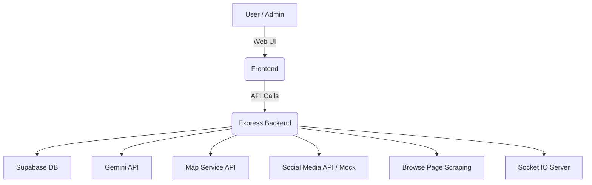

# 🌐 Disaster Response Coordination Platform

A **backend-heavy MERN stack** application designed to assist in **real-time disaster management**. It aggregates critical data from social media, government updates, and user reports. Features advanced geospatial queries, image verification, real-time updates, and external API integrations to support efficient response coordination.

> ⚡ Built with Supabase, Node.js, Google Gemini API, WebSockets, and more — optimized for speed and clarity using tools like Cursor and Windsurf.

---

## 🚀 Project Highlights

* 🔍 **Disaster Intelligence:** Extract and geocode location names from descriptions using Gemini API and mapping services.
* 🧭 **Geospatial Mapping:** Identify nearby resources and affected areas using Supabase geospatial queries.
* 🧵 **Live Social Feeds:** Pull real-time posts from social platforms or mock Twitter API.
* 📰 **Official Updates:** Scrape and cache government sites for verified disaster news.
* 🧠 **Image Verification:** Use Gemini to detect manipulated or AI-generated disaster images.
* 🔁 **Real-Time Sync:** WebSocket-based updates for disaster data, resources, and social media posts.
* 📦 **Data Caching:** Smart Supabase cache system with TTL, reducing redundant API calls.

---

## 🛠️ Tech Stack

* **Frontend:** HTML/CSS/JS or React (minimal interface for testing)
* **Backend:** Node.js, Express.js, Socket.IO
* **Database:** Supabase (PostgreSQL + Geospatial + Caching)
* **External APIs:**

  * [Google Gemini API](https://aistudio.google.com/app/apikey) (NLP + Image)
  * [Google Maps / Mapbox / OpenStreetMap](https://developers.google.com/maps/documentation)
  * [Twitter API / Bluesky](https://developer.twitter.com)
  * Cheerio for web scraping (official updates)
* **AI Tools:** Cursor, Windsurf

---

## 📐 Architecture Overview



---

## 📁 Supabase Schema

### `disasters`

* `id`, `title`, `location_name`, `location (GEOGRAPHY)`, `description`, `tags[]`, `owner_id`, `created_at`, `audit_trail (JSONB)`

### `reports`

* `id`, `disaster_id`, `user_id`, `content`, `image_url`, `verification_status`, `created_at`

### `resources`

* `id`, `disaster_id`, `name`, `location_name`, `location (GEOGRAPHY)`, `type`, `created_at`

### `cache`

* `key`, `value (JSONB)`, `expires_at`

---

## 🔌 REST API Endpoints

### Disaster Management

* `POST /disasters`
* `GET /disasters?tag=flood`
* `PUT /disasters/:id`
* `DELETE /disasters/:id`

### Geolocation

* `POST /geocode`
  → Extracts location using Gemini and geocodes using Map API.

### Social Media

* `GET /disasters/:id/social-media`
  → Fetches related social reports (mock or live).

### Resources

* `GET /disasters/:id/resources?lat=...&lon=...`
  → Nearby support locations via Supabase geospatial.

### Official Updates

* `GET /disasters/:id/official-updates`
  → Web-scraped and cached news (e.g., FEMA, Red Cross).

### Image Verification

* `POST /disasters/:id/verify-image`
  → Uses Gemini API to assess disaster image authenticity.

---

## 📡 Real-Time Events (Socket.IO)

| Event                  | Trigger                            |
| ---------------------- | ---------------------------------- |
| `disaster_updated`     | On create/update/delete disaster   |
| `social_media_updated` | On social report updates           |
| `resources_updated`    | On resource/geospatial data update |

---

## 🔐 Mock Authentication

Hardcoded users and roles:

* `netrunnerX` (admin)
* `reliefAdmin` (contributor)

---

## ⚙️ Supabase Features Used

* Geospatial Indexes:

  ```sql
  CREATE INDEX disasters_location_idx ON disasters USING GIST (location);
  ```

* Tags index:

  ```sql
  CREATE INDEX disasters_tags_idx ON disasters USING GIN (tags);
  ```

* Example geospatial query:

  ```sql
  SELECT * FROM resources
  WHERE ST_DWithin(location, ST_SetSRID(ST_Point(-74.006, 40.7128), 4326), 10000);
  ```

* Cache validation:

  ```js
  if (Date.now() < new Date(cache.expires_at)) return cache.value;
  ```

---

## 🧪 Sample Data

```json
// Disaster
{
  "title": "NYC Flood",
  "location_name": "Manhattan, NYC",
  "description": "Heavy flooding in Manhattan",
  "tags": ["flood", "urgent"],
  "owner_id": "netrunnerX"
}

// Report
{
  "disaster_id": "123",
  "user_id": "citizen1",
  "content": "Need food in Lower East Side",
  "image_url": "http://example.com/flood.jpg",
  "verification_status": "pending"
}

// Resource
{
  "disaster_id": "123",
  "name": "Red Cross Shelter",
  "location_name": "Lower East Side, NYC",
  "type": "shelter"
}
```

---

## 🧪 Setup Instructions

1. **Clone & Install**

   ```bash
   git clone https://github.com/yourusername/disaster-response-platform.git
   cd disaster-response-platform
   npm install
   ```

2. **Environment Setup**

   * `.env`

     ```
     SUPABASE_URL=
     SUPABASE_KEY=
     GEMINI_API_KEY=
     MAPBOX_API_KEY=  # or Google Maps
     ```

3. **Run Locally**

   ```bash
   npm run dev
   ```

4. **Frontend (React or plain HTML)**

   * Hosted separately or inside `/client` folder.
   * Test all backend APIs via UI forms or Postman.

---

## 🧪 Deployment

* **Frontend:** [Vercel](https://vercel.com)
* **Backend:** [Render](https://render.com)
* **Database:** [Supabase](https://supabase.com)

---

## 🧠 AI Tool Usage (Cursor/Windsurf)

* **Cursor**

  * Route generation for WebSocket events (`disaster_updated`, etc.)
  * Cache logic (`Supabase TTL lookup`)
  * Geospatial query logic for nearby resource search

* **Windsurf**

  * Gemini-based geocoding routes
  * Social media mock endpoint scaffolding
  * Supabase structured logging and audit trails

> All AI-generated sections are reviewed and tested manually before integration.

## 💡 Bonus Features (Optional)

* 🆘 **Priority Alert Detection:** Classify reports using simple NLP based on keywords like "SOS", "urgent".
* 🗺️ **Interactive Maps:** Visualize disasters and shelters using Mapbox or Leaflet.
* 🏥 **Nearby Services Fetcher:** Pull live hospital or police location data near a disaster.

